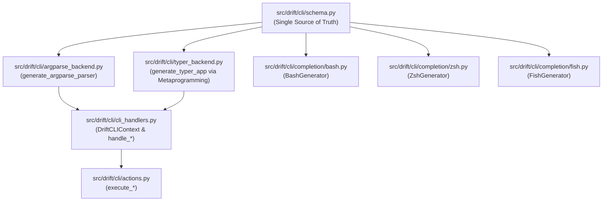

# 🛠️ Drift CLI Reference & Command Specification

## 1. Quick Reference: Command Overview

```bash
drift [--global-flags] <command> [arguments...] [--command-flags]
```

### All Available Commands:

| Command | Command Signature | Purpose |
| :--- | :--- | :--- |
| **`init`** | `drift init [-f] [--no-git-root] [--json]` | Initialize a new Drift workspace repository. |
| **`new`** | `drift new <pkg> [-t <dir>] [-m <stow\|copy>] [-f] [--json]` | Scaffold a new package directory and `drift_package.toml`. |
| **`add`** | `drift add <pkg> <paths...> [--dry-run] [--no-hooks] [--json]` | Import system files into a package with dot-prefix translation. |
| **`status`** | `drift status [packages...] [--json]` | Audit template evolution, active system drift, and pending deltas. |
| **`diff`** | `drift diff [packages...] [-t\|-s] [--stat] [-y] [--json]` | Visualize diffs across template, sandbox, and active system layers. |
| **`deploy`** | `drift deploy [packages...] [-f] [--redeploy] [--no-hooks] [--json]` | Sentinel-guarded sandbox compilation, staging, and deployment. |
| **`rollback`** | `drift rollback [packages...] [-f] [--no-hooks] [--json]` | Rollback failed deployments and restore systems to last clean state. |
| **`adopt`** | `drift adopt [packages...] [-i] [--accept-conflicts] [-f] [--dry-run] [--json]` | Incorporate active runtime system drifts back into source templates. |
| **`uninstall`** | `drift uninstall <packages...> [-f] [--detach] [--dry-run] [--no-hooks] [--json]` | Uninstall packages or detach management while preserving physical files. |
| **`gc`** | `drift gc [--dry-run] [--no-hooks] [--json]` | Identify and purge orphan packages and zombie database folders. |
| **`repair`** | `drift repair [--dry-run] [--json]` | Self-heal damaged or missing workspace components and databases. |
| **`clone`** | `drift clone <git_url> [destination] [-b <branch>] [--depth <N>] [--no-repair] [--json]` | Clone a Git repository and auto-bootstrap/repair the workspace. |
| **`health`** | `drift health [packages...] [-t <seconds>] [-v] [--json]` | Execute runtime health check probes on installed packages. |
| **`complete`** | `drift complete [<shell>] [--install] [--json]` | Generate or install native interactive tab-completion scripts (bash, zsh, fish). |
| **`help`** | `drift help [topic]` | Display interactive mini-manual documentation pages. |
| **`render`** | `drift render [packages...] [--no-hooks] [--json]` | *(Low-Level)* Compile declarative templates into `render/` sandbox. |
| **`render-commit`** | `drift render-commit [packages...] -m "msg" [--json]` | *(Low-Level)* Stage and commit compiled sandbox changes. |
| **`reverse-sync`** | `drift reverse-sync [packages...] [--json]` | *(Low-Level)* Pull active system configuration changes into `install/`. |
| **`stage`** | `drift stage [packages...] [-f] [--json]` | *(Low-Level)* Stage compiled sandbox templates into `install/` state DB. |
| **`apply`** | `drift apply [packages...] [-f] [--no-hooks] [--json]` | *(Low-Level)* Apply state database configurations to host filesystem. |
| **`install-commit`** | `drift install-commit [packages...] -m "msg" [--json]` | *(Low-Level)* Stage and commit deployed configurations in `install/`. |
| **`hook`** | `drift hook <pkg> <hook_name> [--json]` | *(Low-Level)* Directly trigger a specific package lifecycle hook script. |

---

## 2. Global Flags & Movable Flags

*   `-C, --directory <DIR>`: Run as if drift was started in `<DIR>` instead of the current working directory.
*   `--no-git-root`: Bypass searching for parent repository git root; treat the current or `-C` directory as the literal workspace root.
*   `-v, --verbose`: Enable verbose (DEBUG) logging output. (*Movable: can be specified before or after subcommands*).
*   `--json`: Output results in structured machine-readable JSON format using typed result models. (*Movable: can be specified before or after subcommands*).
*   `--raw-errors`: Bypass CLI error boundary to print raw exceptions and full Python stack trace without changing the logging level. (*Movable: can be specified before or after subcommands*).
*   `--trace`: Full diagnostic tracing: enables verbose/debug logging output *and* bypasses the CLI error boundary to print full Python stack traces on exceptions. (*Movable: can be specified before or after subcommands*).

---

## 3. Detailed Command Reference

### A. Initialization: `drift init [--force] [--json]`
Initializes the active directory as a drift workspace.
*   **Command Signature**: `drift init [--force / -f] [--no-git-root] [--json]`
*   **Optional Arguments & Flags**:
    - `--force / -f`: Re-initializes workspace files and database sub-repositories even if already initialized.
    - `--no-git-root`: Treats the target directory as the literal workspace root without searching for parent Git roots.
    - `--json`: Outputs initialization results in structured JSON format.
*   **Actions**:
    1.  If the directory is empty and not tracked by Git, initializes an empty Git repository.
    2.  Verifies the main repository is tracked by Git (unless `--no-git-root` is active).
    3.  Creates `.gitignore` entries to isolate `render/` and `install/` database files.
    4.  Initializes `render/` and `install/` as independent, untracked local Git repositories.
    5.  Creates default directory structure (`src/`, `config/drift_workspace.toml`, `config/envsubst.bash`, `config/mustache.envst.json`, `install/state.toml`).
*   **Terminal Output**:
    ```bash
    ✨ Initialized drift workspace!
    📁 Created render/ sandbox Git database.
    📁 Created install/ local state Git database.
    📝 Generated drift_workspace.toml template.
    📝 Generated config/envsubst.bash, config/mustache.envst.json, and config/jinja2.mustache.json.
    ```

---

### B. Package Creation: `drift new <package> [--force] [--target <dir>] [--method <stow|copy>] [--json]`
Create a new package directory with the default `drift_package.toml` configuration file.
*   **Command Signature**: `drift new <package> [--force / -f] [--target / -t <target_directory>] [--method / -m <install_method>] [--json]`
*   **Optional Arguments & Flags**:
    - `--force / -f`: Forcefully overwrites any existing `drift_package.toml` config file inside the package source directory.
    - `--target / -t <target_directory>`: Explicitly configures the deployment target directory inside `drift_package.toml`. Defaults to `default_target_directory` in `drift_workspace.toml`.
    - `--method / -m <install_method>`: Explicitly configures the installation method (`stow` or `copy`) inside `drift_package.toml`. Defaults to `default_install_method` in `drift_workspace.toml`.
    - `--json`: Outputs a `NewPackageResult` object in JSON format.
*   **Probing Guard**: Halts if a configuration file already exists inside `src/<package>/` unless `--force` is provided.

---

### C. Resource Import: `drift add <package> <paths...> [--dry-run] [--no-hooks] [--json]`
Import physical active system configuration files or directories into your declarative source folder.
*   **Command Signature**: `drift add <package> <paths...> [--dry-run] [--no-hooks / --no-hook] [--json]`
*   **Dry-Run Mode**: Passing `--dry-run` performs all symlink resolutions, prefix translations, and path calculations, previewing changes without touching disk.
*   **Bypass Lifecycle Hooks**: Passing `--no-hooks` (or `--no-hook`) bypasses execution of the `pre_source` hook.
*   **Dot-Prefix Translation**: Files and directories starting with `.` are automatically translated to `dot-` prefixes (e.g., `.config/nvim/init.lua` $\rightarrow$ `dot-config/nvim/init.lua`).
*   **Symlink Resolution Policy**: If an input path is a symlink pointing outside the state database, Drift resolves the target and copies physical contents for reproducibility.

---

### D. Status Inspection: `drift status [packages...] [--json]`
Analyzes and aggregates current system alignment across three vectors:
*   **Template Status [A]**: Did template files under `src/` evolve compared to `render/`?
*   **System Drift Status [B]**: Has the host system drifted from `install/` due to runtime edits?
*   **Pending Delta [Δ]**: Are there differences waiting to be deployed from `render/` to `install/`?

```bash
$ drift status

Package: nvim
  [A] Template: MODIFIED
      M nvim/init.lua
  [B] System:   CLEAN
  [Δ] Pending:  STAGED
      (+1, ~1, -0 files)
```

---

### E. Change Visualization: `drift diff [packages...] [options] [--json]`
Provides deep comparisons between configuration layers:
*   **`drift diff [packages...]` (Default: Pending Delta / Diff Δ)**: Compares `render/` against `install/`.
*   **`drift diff [packages...] --template` (or `-t`, Diff A)**: Visualizes Template Evolution (`src/` vs `render/`).
*   **`drift diff [packages...] --system` (or `-s`, Diff B)**: Visualizes Active System Drift (`System` vs `install/`).
*   **`drift diff [packages...] --stat`**: Shows a concise diffstat summary of file change counts.
*   **`drift diff [packages...] --side-by-side` (or `-y`)**: Displays side-by-side vertical terminal diff comparisons.
*   **`--json`**: Returns a typed `DiffResult` containing per-package added, modified, and deleted files.

---

### F. Safe Deployment: `drift deploy [packages...] [--force] [--redeploy] [--no-hooks] [--json]`
Deploys configurations using an atomic two-stage compilation and application engine.

*   **Command Options**:
    - `packages...`: Optional package name(s) to deploy. If omitted, performs a global deployment of all active packages.
    - `--force / -f`: Bypasses the Stage 1 Sentinel Drift audit (overriding uncommitted host system changes), ignores midway failed states (`staging`/`deploying` in `install/state.toml`), and bypasses uncommitted modifications safeguards in `install/`. *(Note: Does **not** bypass `enable_install = false`).*
    - `--redeploy`: Force full redeployment of all packages, bypassing stage change skipping. By default, Drift analyzes staging changes (`installed_files`, hook scripts, and `drift_package.toml`) and skips deploying packages whose stage outputs are unchanged. Passing `--redeploy` forces all lifecycle hooks and physical file applications to execute regardless of stage changes.
    - `--no-hooks / --no-hook`: Completely bypasses executing all lifecycle hooks across rendering, deployment, and post-deploy garbage collection.
    - `--json`: Outputs a `DeployResult` in structured JSON format.

#### Stage 0: Pre-flight Checks
Verifies Git committability on `render/` and `install/` and discovers target packages.

#### Stage 1: Safety Guard (Sentinel)
1.  Pulls current host configuration state into `install/` (`Primitive 1`).
2.  If uncommitted drift exists: **Aborts immediately** (exit code `3`) and guides the user to `drift diff -s` or `drift adopt`. Pass `--force` to override.

#### Stage 2: Sequential Compile & Apply
1.  **Render**: Sandbox-compiles `src/` templates into `render/` (`Primitive 2`).
2.  **Commit Render**: Commits compiled sandbox history (`Primitive 3`).
3.  **Stage Render to Install**: Staged delta-sync from `render/` to `install/` (`Primitive 4`).
4.  **Install Deployment**: Delivers files via atomic stow/copy with collision checking (`Primitive 5`).
5.  **Commit Install**: Scope-commits deployed configurations in `install/` (`Primitive 6`).

#### Stage 3: Post-deploy Garbage Collection
When deploying globally without specific package names, Drift automatically executes `drift gc` (`Primitive 9`).

---

### G. Recovery: `drift rollback [packages...] [--force] [--no-hooks] [--json]`
Reverts failed midway deployments and restores system files to the last committed clean state.
*   **Command Options**:
    - `packages...`: Optional package name(s) to rollback. If omitted, discovers all packages in the local state database.
    - `--force / -f`: Bypasses the failed midway conflict state safeguard (`staging` or `deploying`), allowing a hard reset of packages to their last committed clean Git HEAD state even if they are currently in `installed` state.
    - `--no-hooks / --no-hook`: Bypasses execution of lifecycle hooks during rollback.
    - `--json`: Outputs a list of rolled-back package names in JSON format.
*   **Mechanism (Primitive 8)**:
    1.  Resets `install/` database for target packages to the last clean HEAD commit.
    2.  Resets `install/state.toml` back to HEAD.
    3.  Performs a **Full Redeploy** restoring physical target system files.
    4.  Restores state registry entries back to `"installed"`.

---

### H. Synchronization & Bidirectional Drift Adoption: `drift adopt [packages...] [options] [--json]`
Incorporate runtime system/GUI changes back into your declarative templates under `src/`.
*   **Command Options**:
    - `packages...`: Optional package name(s) to adopt. If omitted, all drifted packages are adopted.
    - `--interactive / -i`: Interactively prompt for each modified, added, or deleted file.
    - `--accept-conflicts`: Apply conflicting patches, writing merge conflict markers directly into templates.
    - `--force / -f`: Bypasses the Git cleanliness safeguard on package source directories (`src/<package>/`), allowing adoption to proceed even if the source directory has uncommitted modifications.
    - `--dry-run`: Simulate adoption without writing changes to disk.
    - `--no-hooks / --no-hook`: Bypass execution of `pre_source` lifecycle hooks.

---

#### I. Uninstallation & Detachment: `drift uninstall <packages...> [--force] [--detach] [--dry-run] [--no-hooks] [--json]`
*   **Command Options**:
    - `<packages...>`: Package name(s) to uninstall.
    - `--force / -f`: Bypasses the active package safeguard, allowing uninstallation of packages that are still active/enabled in `config/drift_workspace.toml`.
    - `--detach`: Decouples package management while keeping physical configuration files intact on the host system.
    - `--dry-run`: Simulates uninstallation without deleting files from disk.
    - `--no-hooks / --no-hook`: Skips `pre_uninstall` and `post_uninstall` lifecycle hooks.
    - `--json`: Returns a typed `UninstallResult` in JSON format.
*   **Standard Mode (Default)**: Removes symlinks/files, restores collision backups, deletes `install/<package>/`, and commits to the state database.
*   **Detach Mode (`--detach`)**: Decouples package management while keeping physical configuration files intact on the host system.

---

### J. Garbage Collection: `drift gc [--dry-run] [--no-hooks] [--json]`
Identifies and purges orphaned and untracked database entities across the workspace.
*   **Orphan Packages**: Uninstalls packages present in `install/` state database but disabled in `drift_workspace.toml`.
*   **Zombie Folders**: Identifies and purges package subdirectories in `render/` and `install/` that lack valid configuration files.

---

### K. Health Audit & Workspace Repair: `drift repair [--dry-run] [--json]`
Audits and self-heals damaged, missing, or partially-initialized workspace components (directories, Git sub-repositories, `.gitignore` entries, configuration templates, and state registries).

---

### L. Workspace Cloning & Bootstrapping: `drift clone <repository> [destination] [--branch] [--depth] [--json]`
Clones a remote or local Git repository and immediately reconstructs and heals the workspace for deployment.
*   **Command Signature**: `drift clone <repository> [destination] [--branch / -b <branch>] [--depth <depth>] [--no-repair] [--json]`
*   **Autonomous Bootstrap Healing**:
    - **Existing Drift Workspace**: Reconstructs untracked runtime databases (`render/` and `install/` Git repos, `state.toml`, `.gitignore`, `config/secrets.env`).
    - **Legacy Dotfiles Repository**: Migrates root dotfiles into `src/<pkg>/`, generates `drift_package.toml` with `stow` install method, and registers in `drift_workspace.toml`.

---

### M. Package Runtime Health Probing: `drift health [packages...] [--from install|source] [--timeout] [--json]`
Executes runtime health check probes on packages to verify if deployed services, daemons, terminal environments, and host tools are operating properly.
*   **Command Signature**: `drift health [packages...] [--from <install|source>] [--timeout <seconds>] [--json]`
*   **Execution Invariants**: Reads from `install/<pkg>/` (`--from install`, default) or `src/<pkg>/` (`--from source`), executing with package `target_directory` as active CWD in user space and injecting all package environment variables.

---

### N. Shell Tab-Completion Generation: `drift complete [<shell>] [--install] [--json]`
Generates zero-latency native shell tab-completion scripts compiled directly from the authoritative CLI schema, or installs them directly into user completion directories.
*   **Command Signature**: `drift complete [shell] [--install / -i] [--json]`
*   **Supported Shells**: `bash`, `zsh`, `fish`, `nu` (or `nushell`). (If omitted, auto-detects from `$SHELL`).
*   **Auto-Installation to Standard Directories (`--install`)**:
    ```bash
    drift complete --install          # Installs completion files for all supported shells (bash, zsh, fish, nu)
    drift complete nu --install       # Installs directly to ~/.config/nushell/completions/drift.nu
    drift complete fish --install     # Installs directly to ~/.config/fish/completions/drift.fish
    drift complete bash --install     # Installs directly to ~/.local/share/bash-completion/completions/drift
    drift complete zsh --install      # Installs directly to ~/.local/share/zsh/site-functions/_drift
    ```
*   **Dynamic Startup Evaluation**:
    ```bash
    # Bash (~/.bashrc)
    eval "$(drift complete bash)"
    # Zsh (~/.zshrc)
    eval "$(drift complete zsh)"

    # Fish (~/.config/fish/config.fish)
    drift complete fish | source

    # Nushell (~/.config/nushell/config.nu)
    use ~/.config/nushell/completions/drift.nu *
    ```

---

### O. Mini User Manual: `drift help [topic]`
Provides built-in documentation with automatic terminal pager fallback.
*   **Syntax**: `drift help [topic]`
*   **Available Topics**: `overall`, `package`, `src`, `render`, `install`, `fcd`, `ignore`, `drift_package.toml`, `drift_workspace.toml`, `workspace`, `health`, `clone`, `faq`.

---

### P. Low-Level Control Commands
For advanced continuous integration, scripting, and pipeline automation:
1.  **`drift render [packages...] [--no-hooks] [--json]`**: Compiles source templates to sandbox `render/` (`Primitive 2`).
2.  **`drift render-commit [packages...] -m "message" [--json]`**: Stages and commits compiled sandbox changes (`Primitive 3`).
3.  **`drift reverse-sync [packages...] [--json]`**: Pulls live host configuration changes into `install/` (`Primitive 1`).
4.  **`drift stage [packages...] [--force] [--json]`**: Computes delta and stages sandbox to `install/` (`Primitive 4`). Pass `--force` to bypass midway failed state checks and uncommitted modifications in `install/` *(does not bypass `enable_install = false`)*.
5.  **`drift apply [packages...] [--force] [--no-hooks] [--json]`**: Deploys `install/` state to host paths (`Primitive 5`). Pass `--force` to bypass midway failed state checks in `install/state.toml` *(does not bypass `enable_install = false`)*.
6.  **`drift install-commit [packages...] -m "message" [--json]`**: Commits deployed configurations inside `install/` (`Primitive 6`).
7.  **`drift hook <package> <hook-name> [--json]`**: Directly executes a specific lifecycle hook script for a single package.

---

## 4. Unified Semantics of the `--force` Flag

Drift enforces a clear architectural distinction between **runtime safety safeguards** and **declarative package configurations**:

> [!IMPORTANT]
> The `--force` flag is designed to override **runtime safety checks, state interlocks, and sentinel barriers** (such as dirty Git states, midway failure locks, collision safeguards, or active package uninstallation restrictions).
>
> **The `--force` flag NEVER overrides declarative package configuration settings** (such as `enable_install = false` in `drift_package.toml`). If a package is declared as non-installable, it will remain excluded from staging and deployment regardless of whether `--force` is supplied.

### Summary Matrix of `--force` Behaviors

| Command | Primitive | What `--force` Overrides | Invariants Respected (Not Bypassed) |
| :--- | :--- | :--- | :--- |
| **`drift new <pkg> --force`** | Primitive 10 | Overwrites existing `drift_package.toml` in `src/<pkg>/` | Valid package naming rules |
| **`drift deploy --force`** | Primitive 4, 5, Pipeline | • Bypasses Stage 1 Sentinel Drift audit (proceeds despite uncommitted host changes in `install/`)<br>• Bypasses `"staging"` / `"deploying"` mid-failure state locks in `state.toml`<br>• Bypasses uncommitted modifications check in `install/` | `enable_install = false` is strictly respected |
| **`drift stage --force`** | Primitive 4 | • Bypasses `"staging"` / `"deploying"` mid-failure state locks in `state.toml`<br>• Ignores uncommitted modifications in `install/` | `enable_install = false` is strictly respected |
| **`drift apply --force`** | Primitive 5 | Bypasses `"staging"` / `"deploying"` mid-failure state locks in `state.toml` | `enable_install = false` is strictly respected |
| **`drift rollback --force`** | Primitive 8 | Bypasses conflict state check; forces hard reset to clean Git HEAD even for packages in `"installed"` state | Valid package tracking in `install/` |
| **`drift adopt --force`** | Primitive Adopt | Bypasses Git cleanliness safeguard on `src/<pkg>/` (adopts drifts despite dirty source tree) | Valid patch application |
| **`drift uninstall --force`** | Primitive 7 | Bypasses active package safeguard (uninstalls packages still enabled in `drift_workspace.toml`) | Only installed packages are uninstalled |
| **`drift init --force`** | Workspace Init | Overwrites existing workspace templates and database configurations | Root path safety checks |

---

## 5. Standardized Process Exit Codes

| Exit Code | Semantic Meaning | Description |
| :---: | :--- | :--- |
| **`0`** | **`SUCCESS` / `HEALTHY`** | The command completed cleanly; status is clean, diffs match, or all health probes passed. |
| **`1`** | **`GENERAL_ERROR` / `UNHEALTHY`** | Runtime failure, subprocess crash, unresolved file collision, or unhealthy probe. |
| **`2`** | **`CONFIG_ERROR`** | Missing or malformed `drift_workspace.toml`, `drift_package.toml`, or invalid configuration types. |
| **`3`** | **`DRIFT_DETECTED`** | Sentinel safety guard tripped: uncommitted runtime system changes detected on host. |
| **`4`** | **`RENDER_ERROR`** | Template compilation failure or missing required environment variable. |
| **`5`** | **`COLLISION_ERROR`** | Target file collision detected during install or apply. |
| **`6`** | **`HEALTH_CHECK_FAILED`** | Package health check probe failed or returned non-zero exit status. |
| **`7`** | **`HOOK_SKIPPED`** | Direct hook trigger bypassed or skipped because the hook is not configured or disabled. |

---

## 6. CLI Schema & Generator Design Architecture

To maintain absolute consistency between the CLI runtime, interactive help, argument parsing, error boundaries, and tab completions across multiple shells, Drift is built on a **Single Source of Truth (SSOT)** architecture.



### 1. Pure Declarative Schema (`src/drift/cli/schema.py`)
- Defines data models: `OptionSpec`, `PositionalSpec`, `CommandSpec`, `CompletionSchema`, and choice registries (`LIFECYCLE_HOOKS`, `HELP_TOPICS`, `SHELLS`, etc.).
- Defines `MOVABLE_GLOBAL_FLAGS = ["--json", "-v", "--verbose", "--raw-errors", "--trace"]` enabling global flags to appear before or after subcommands.
- Contains zero framework dependencies (`argparse` or `typer`), acting as pure metadata.

### 2. Argparse Parser Generator (`src/drift/cli/argparse_backend.py`)
- Dynamically iterates over `CompletionSchema` to construct an `argparse.ArgumentParser` on demand.
- Attaches movable global flags to subparsers with `default=argparse.SUPPRESS` so flags like `-v` and `--json` resolve accurately in any position.

### 3. Typer Metaprogramming Generator (`src/drift/cli/typer_backend.py`)
- Programmatically constructs `typer.Typer` command functions at runtime using `inspect.Signature` and `inspect.Parameter` synthesis.
- Automatically handles context injection (`ctx: typer.Context`), positional arguments (`typer.Argument`), and option flags (`typer.Option`) with descriptions and mutual exclusion.

### 4. Unified Router & Handlers (`src/drift/cli/cli_handlers.py`)
- Defines `DriftCLIContext` encapsulating root directory discovery, `--json` mode state, and rich terminal printing.
- Implements unified `handle_<command>()` functions wrapped with `cli_error_boundary` to guarantee identical error handling, formatting, and exit codes across all backends.

### 5. Shell Tab-Completion Generators (`src/drift/cli/completion/`)
- **Bash Generator (`bash.py`)**: Produces native `_drift_completion()` with `_drift_packages()` dynamic package scanning and positional argument counters.
- **Zsh Generator (`zsh.py`)**: Produces `#compdef drift` using `_arguments` and `_describe` with interactive documentation menus.
- **Fish Generator (`fish.py`)**: Produces declarative `complete -c drift` rules with condition predicates (`__fish_use_subcommand` / `__fish_seen_subcommand_from`).
