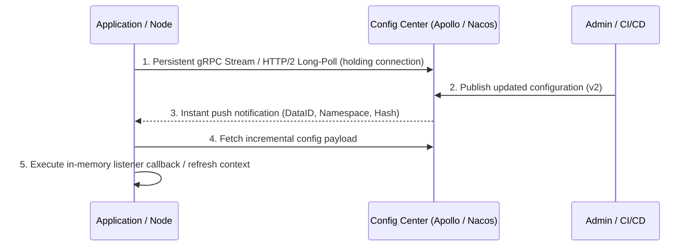
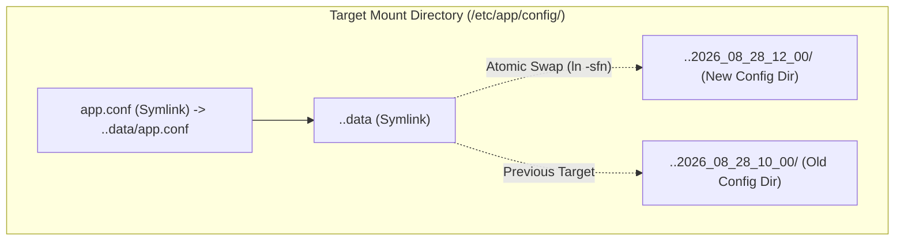
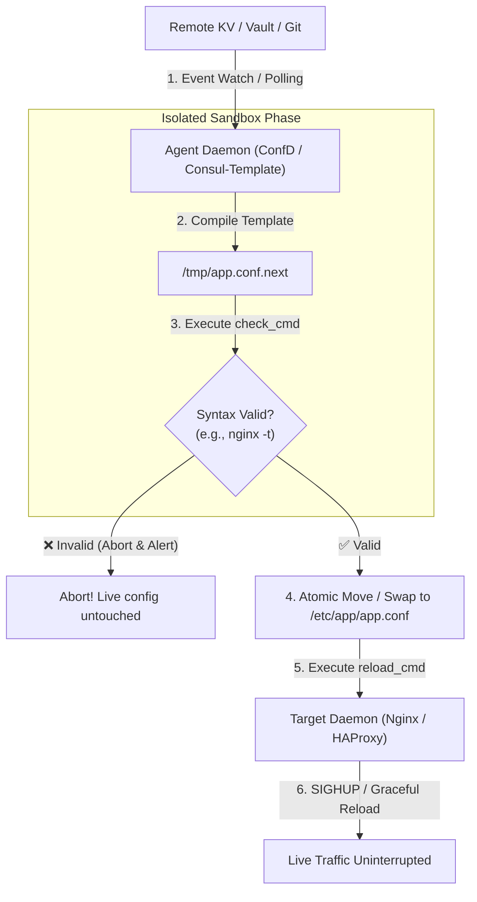

# Cloud Configuration Management: Synchronization, Installation & Activation

This document provides a structured architectural guide to modern cloud configuration management systems. It details how industrial systems (**GitOps**, **Dynamic Config Centers**, **Node Agents / Sidecars**, and **SDKs**) handle configuration distribution, safety checks, filesystem materialization, and service activation.

---

## 1. Executive Summary & Solution Matrix

Industrial configuration management is divided into two distinct responsibilities:
1. **Synchronization (Distribution)**: Transporting configuration data from a central source of truth to target nodes.
2. **Installation & Activation (Materialization)**: Validating syntax, rendering templates, writing atomically to the filesystem or memory, and signaling services to reload.

| Solution Category | Representative Tools | Primary Functionality | Main Usage Scenarios | How It Checks for Changes | How It Triggers & Activates |
| :--- | :--- | :--- | :--- | :--- | :--- |
| **Dynamic Config Centers** | **Apollo**, **Nacos**, **Consul KV**, **Etcd** | Centralized parameter storage, multi-tenant namespaces, fine-grained canary/gray releases. | Large-scale microservice architectures, runtime feature toggles, dynamic rate limiting. | HTTP/2 long-polling, persistent gRPC bi-directional push streams. | Emits in-memory update events to SDK listeners or local sidecars. |
| **GitOps Controllers** | **ArgoCD**, **FluxCD**, **Kubernetes Kubelet** | Declarative state reconciliation, full Git auditability, disaster recovery from commits. | Kubernetes clusters, multi-region application deployments, cloud infrastructure. | Continuous reconciliation loops (polling Git commits / OCI tags + Webhook triggers). | Kubelet atomic symlink farm swap (`..data`), pod rolling restart, or volume notify. |
| **Node Agents & Sidecars** | **Consul-Template**, **ConfD**, **Vault Agent** | Decouples native apps from central KV/Vault; sandbox template rendering; pre-flight validation. | Critical network daemons (**Nginx**, **HAProxy**, **Envoy**, **Prometheus**), zero-trust ephemeral secret rotation. | Long-polling or event streaming from remote KV / Vault leases. | **Pre-flight syntax check** (`nginx -t`) $\rightarrow$ Atomic file rename $\rightarrow$ Process signal (`SIGHUP` / `systemctl reload`). |
| **In-Memory SDKs** | **Spring Cloud** (`@RefreshScope`), **Viper** | In-process dynamic property binding, zero-disk I/O. | Pure Java/Go/Node backend microservices. | In-process background polling or client event bus. | Dynamic hot-reloading of in-memory configuration beans and connection pools. |
| **Host Package Managers** | **Drift**, **GNU Stow**, **Chezmoi** | Declarative dotfile and host configuration management; multi-engine template compilation. | Developer workstations, Linux/Windows host configuration, fleet system administration. | Local/remote Git synchronization, drift detection via reverse sync. | Pre-render sandbox $\rightarrow$ Pre-flight validation $\rightarrow$ Atomic symlink/copy $\rightarrow$ Lifecycle hooks (`pre_source`, `post_render`, `post_deploy`). |

---

## 2. The 3-Tier Architectural Pipeline

```mermaid
flowchart LR
    subgraph Central["1. Central Plane (Source of Truth)"]
        Git["GitOps Repositories\n(GitHub / GitLab)"]
        Center["Dynamic Config Centers\n(Apollo / Nacos / Etcd)"]
        Vault["Secret Vaults\n(HashiCorp Vault / KMS)"]
    end

    subgraph Sync["2. Synchronization Tier"]
        Pull["GitOps Controllers\n(ArgoCD / FluxCD)"]
        Push["gRPC Streams / Long-Polling\n(Agent / Sidecar / SDK)"]
    end

    subgraph Install["3. Installation & Activation Tier"]
        Render["Sandbox Template Rendering\n(Jinja2 / Go Template / Mustache)"]
        Verify["Pre-Flight Syntax Validation\n(e.g., nginx -t, promtool)"]
        Swap["Atomic Materialization\n(Symlink Swap / In-place Rename)"]
        Reload["Lifecycle Signal & Activation\n(SIGHUP / Hot Reload / Hooks)"]
    end

    Central --> Sync
    Sync --> Render --> Verify --> Swap --> Reload
```



---

## 3. Deep Dive into Major Solution Categories

---

### Category A: Dynamic Centralized Configuration Centers

#### 1. Functionality
Dynamic configuration centers serve as real-time distributed key-value/document stores with enterprise governance, role-based access control (RBAC), multi-environment namespaces (Dev/Staging/Prod), and fine-grained release rules.

#### 2. Main Usage Scenarios
* **Runtime Feature Flags**: Toggling features on/off instantly without deploying new container images.
* **Canary / Gray Rollouts**: Pushing configuration changes to 5% of client instances or specific IP ranges first.
* **Dynamic Database & Circuit Breaker Tuning**: Adjusting connection pool sizes or timeout thresholds during traffic surges.

#### 3. How It Checks & Triggers


---

### Category B: Declarative GitOps & Cluster Controllers

#### 1. Functionality
GitOps treats a Git repository as the immutable, auditable single source of truth. Cluster controllers continuously observe the actual live state and automatically reconcile any drift back to the state declared in Git.

#### 2. Main Usage Scenarios
* **Cluster-Wide Infrastructure**: Deploying Kubernetes manifests, Helm charts, and Kustomize overlays across dozens of clusters.
* **Audited Change Management**: Enforcing that all configuration updates go through pull requests, peer reviews, and automated CI pipelines.
* **Disaster Recovery**: Rebuilding an entire environment from scratch purely from the Git commit history.

#### 3. How It Checks & Triggers
* **Change Detection**: The controller polls the remote Git repository every $N$ seconds, or receives an instant push webhook notification on `git push`.
* **Filesystem Materialization (Kubernetes Symlink Farm)**:
  To prevent applications from reading half-written files, the Kubelet uses a double-symlink swap pattern:



1. **Step 1**: Creates a hidden timestamped directory `..2026_08_28_12_00/` and writes all files completely.
2. **Step 2**: Atomically swaps the intermediate symlink `..data` to point to the new directory using an atomic rename (`rename(2)`).
3. **Step 3**: Unlinks old timestamped directories during garbage collection.

---

### Category C: Node-Level Agents & Sidecar Proxies

#### 1. Functionality
Node agents (**Consul-Template**, **ConfD**, **Vault Agent**) bridge the gap between dynamic remote infrastructure (which changes IP addresses, service topologies, and secret tokens) and standard OS daemons (which only know how to read static local files).

#### 2. Main Usage Scenarios
* **Reverse Proxies & Gateways**: Dynamically updating upstream server pools in **Nginx**, **HAProxy**, or **Envoy**.
* **Monitoring & Service Discovery**: Dynamically generating scrape target lists in **Prometheus**.
* **Zero-Trust Secret Rotation**: Injecting temporary, auto-rotating database credentials and mTLS certificates from **HashiCorp Vault**.

#### 3. How It Checks & Triggers (The 6-Step Execution Lifecycle)



#### Example Configuration: ConfD (`/etc/confd/conf.d/nginx.toml`)
```toml
[template]
src = "nginx.tmpl"
dest = "/etc/nginx/nginx.conf"
keys = [
    "/services/web/upstream",
    "/nginx/worker_processes"
]

# 🔍 PRE-FLIGHT CHECK: Must succeed before touching live files
check_cmd = "/usr/sbin/nginx -t -c {{.src}}"

# 🚀 ACTIVATION TRIGGER: Graceful daemon reload
reload_cmd = "/usr/sbin/systemctl reload nginx"
```

---

## 4. The 6-Stage Industrial Safety Lifecycle

Every enterprise configuration agent implements this sequential safety pattern:

| Step | Phase Name | Technical Action | Why It Is Critical |
| :---: | :--- | :--- | :--- |
| **1** | **Ingestion & Resolution** | Reads source templates, environment variables, and remote KV/Vault state. | Consolidates network calls, manages auth tokens, and handles retries. |
| **2** | **Sandbox Compilation** | Compiles template engines into an **isolated temporary sandbox file** (e.g. `/tmp/app.conf.next`). | Prevents template syntax errors from touching or corrupting live files. |
| **3** | **Pre-Flight Validation** | Runs application syntax checker (e.g. `nginx -t`, `haproxy -c`, `promtool check config`). | **Circuit breaker**: Blocks broken configurations before they reach production services. |
| **4** | **Atomic Materialization** | Moves the sandboxed file into place via `rename(2)` or atomic symlink pointer rotation. | Guarantees that target processes never read half-written files. |
| **5** | **Lifecycle Signaling** | Dispatches `SIGHUP`, calls `/v1/reload`, or executes post-deployment hooks. | Applies new configuration with zero dropped TCP connections. |
| **6** | **State Auditing & Rollback** | Records state commits, checksums, and previous backups. | Enables instant rollback if unexpected runtime bugs occur. |

---

## 5. Architectural Comparison: SDK vs. GitOps vs. Agent Proxy

| Comparison Criteria | In-App SDK | GitOps Controller | Node Agent / Sidecar Proxy | Host Dotfile Manager (Drift) |
| :--- | :--- | :--- | :--- | :--- |
| **Application Coupling** | High (SDK embedded in code) | Zero (reads plain files/manifests) | Zero (reads plain local files) | Zero (manages native files/symlinks) |
| **Language Support** | Limited to supported SDKs | Universal (any container/OS) | **Universal** (Nginx, C++, Go, Python, Bash) | **Universal** (POSIX, Windows, macOS) |
| **Blast Radius Protection** | Relies on app exception handling | Gated by Git CI/CD tests | **Built-in Pre-Flight Gatekeeper** (`check_cmd`) | **Sandbox Render + Pre-Flight Deploy** |
| **Ephemeral Secret Rotation** | App must manage token lifecycle | Not designed for hourly secret leases | **Native lease manager** (auto-renews tokens) | Secrets scope injection & isolation |
| **Drift Detection & Reverse Sync** | ❌ No | ⚠️ Reconciles by overwriting | ❌ Overwrites local edits | ✅ **Full Bidirectional Drift Adoption** |

---

## 6. How Drift Aligns with Industrial Cloud Patterns

**Drift** adapts these cloud-grade patterns for host systems, dotfiles, and fleet configuration management:

1. **Decoupled 3-Tier Compilation**: Drift divides deployment into `src/` (declarative templates) $\rightarrow$ `render/` (isolated sandbox compilation) $\rightarrow$ `install/` (atomic staging database) $\rightarrow$ `host` (active filesystem).
2. **Lifecycle Hooks**: Provides `pre_source`, `post_render`, and `post_deploy` hooks equivalent to industrial agent `check_cmd` and `reload_cmd`.
3. **Encoding & Permission Protection**: Implements `LineEnding` normalization (LF $\leftrightarrow$ CRLF) and Windows Read-Only unlocking (`unlock_file_or_dir_if_windows()`) to guarantee safe cross-platform operations.
4. **Bidirectional Drift Adoption**: Unlike standard cloud agents that blindly overwrite manual host edits, Drift detects uncommitted local changes and provides an interactive reconciliation engine (`drift adopt`) to safely merge host modifications back into the declarative source.
