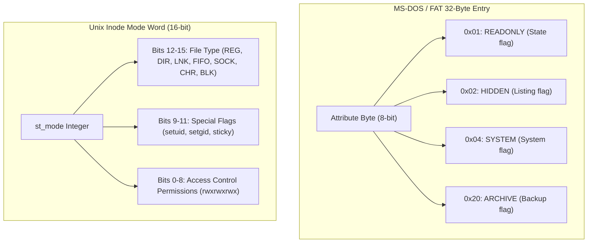
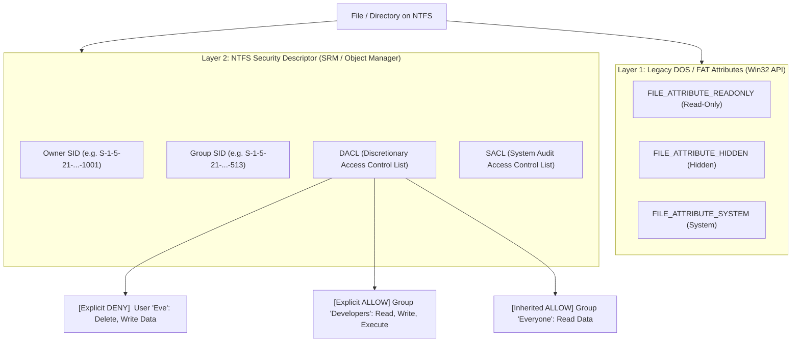

# File Permission Models & ACL Architecture Reference

This document provides a comprehensive technical reference for the file permission and Access Control List (ACL) architectures across operating systems (**POSIX/Linux**, **Windows NTFS**, **macOS APFS**, and **OpenZFS/NFSv4**), as well as their practical implications for cross-platform configuration and dotfile management in **Drift**.

---

## 1. Executive Summary & Comparison Matrix

Operating systems use different security abstractions to control file access. While traditional Unix relies on discrete 9-bit permission masks (`rwxrwxrwx`), modern enterprise filesystems use **Access Control Lists (ACLs)** with fine-grained access rights, explicit negative rules (`DENY`), and dynamic inheritance.

| Security Dimension | Traditional POSIX Mode | Linux POSIX.1e ACLs (`getfacl`) | Windows NTFS Security Descriptors | Modern RichACL / NFSv4 / OpenZFS | macOS APFS / HFS+ |
| :--- | :--- | :--- | :--- | :--- | :--- |
| **Standard / Origin** | POSIX.1 (IEEE 1003.1) | POSIX 1003.1e Draft 17 (Withdrawn 1997) | Windows NT 3.1 (1993, VMS Heritage) | RFC 3530 / RFC 7530 / OpenZFS | Apple Mac OS X 10.4+ / APFS |
| **Identity System** | Integer `uid` & `gid` | Integer `uid` & `gid` | Domain-aware **SIDs** (`S-1-5-...`) | Principal strings (`user@realm`) or UIDs | Apple Generated UIDs (GUIDs/UUIDs) |
| **Permission Bits** | 3 bits (`r`, `w`, `x`) | 3 bits (`r`, `w`, `x`) + `mask` | **14 granular rights** + Generic masks | **14 granular rights** (NTFS parity) | **14 granular rights** (NTFS parity) |
| **Explicit Deny** | ❌ No | ❌ No (Additive only) | ✅ Yes (`DENY` ACEs evaluate first) | ✅ Yes (`DENY` ACEs evaluate first) | ✅ Yes (`DENY` ACEs evaluate first) |
| **Inheritance Model** | None | **Static Default ACLs** (Created once; no cascade) | **Dynamic Automatic Inheritance** (Parent updates cascade to children) | **Dynamic Automatic Inheritance** | **Dynamic Automatic Inheritance** |
| **Executability Check** | `+x` permission bit | `+x` permission bit | File extension (`.exe`, `.bat`, etc.) + ACL rights | `+x` bit or `EXECUTE` right | `+x` bit + `EXECUTE` right |
| **Security Auditing** | External (`auditd`) | External (`auditd`) | **Native SACL** (Success/Failure audits) | Native Audit / Alarm ACEs | Native Audit ACEs |

---

## 2. Low-Level Inode & Directory Entry Bit Formats (DOS vs. Unix)

The fundamental difference between Windows and Unix begins at the lowest filesystem metadata layer:



### A. MS-DOS / FAT Attribute Byte (Property Flags, NOT Access Control)
In MS-DOS (FAT filesystems), each file entry had an **Attribute Byte** (8 bits):
* `0x01` (`READONLY`): Indicates software should not overwrite or delete the file.
* `0x02` (`HIDDEN`): Hidden from default directory listings (`dir`).
* `0x04` (`SYSTEM`): Operating system file (`IO.SYS`, `MSDOS.SYS`).
* `0x08` (`VOLUME_ID`): Volume label.
* `0x10` (`DIRECTORY`): Subdirectory indicator.
* `0x20` (`ARCHIVE`): Marked whenever a file is created or changed (used by backup utilities).

> **Crucial Insight**: These flags were **file properties / state flags**, not access control. DOS was a single-user system without kernel memory isolation or user accounts; any program could directly write to disk sectors via BIOS interrupts (`INT 13h`) or clear the read-only bit with `INT 21h`.
>
> When Windows NT was designed, Microsoft preserved these DOS property flags in the Win32 API for backward compatibility, but built the actual multi-user security system (NTFS DACLs) completely alongside and underneath them.

### B. Traditional Unix Inode Mode Word (`st_mode`)
Traditional Unix never had "Hidden" or "System" property bits. Instead, every inode contains a 16-bit integer (`st_mode`):
1. **File Type (Bits 12–15)**:
   * `S_IFREG` (`0100000`): Regular file
   * `S_IFDIR` (`0040000`): Directory
   * `S_IFLNK` (`0120000`): Symbolic link
   * `S_IFIFO` (`0010000`): FIFO (Named Pipe)
   * `S_IFSOCK` (`0140000`): UNIX Domain Socket
   * `S_IFCHR` (`0020000`): Character Device (`/dev/null`, `/dev/tty`)
   * `S_IFBLK` (`0060000`): Block Device (`/dev/sda`)
2. **Special Execution Flags (Bits 9–11)**:
   * `setuid` (`04000`): Execute with file owner's UID.
   * `setgid` (`02000`): Execute with file group's GID (or inherit directory group).
   * `sticky bit` (`01000`): In shared directories like `/tmp`, only the file owner can delete their file.
3. **Access Permissions (Bits 0–8)**:
   * 3 bits each for User, Group, and Other (`rwxrwxrwx`).

### C. Conceptual Contrasts
* **Hidden Files**: On Windows, it is an explicit attribute bit (`FILE_ATTRIBUTE_HIDDEN`). On Unix, it is a **pure naming convention** (any file starting with a dot `.`).
* **Read-Only Status**: On Windows, it is an explicit attribute bit (`FILE_ATTRIBUTE_READONLY`) that blocks Win32 delete/overwrite API calls. On Unix, it is the **absence of the write bit (`w`)** in `st_mode`.
* **System Files**: On Windows, an explicit bit flag (`FILE_ATTRIBUTE_SYSTEM`). On Unix, it is **ownership and path convention** (files in `/etc`, `/usr` owned by `root`).
* **Modern Linux Inode Attributes (`chattr` / `lsattr`)**: Linux later introduced filesystem attribute flags on ext4/XFS:
  * `+i` (**Immutable**): Prevents any user, including `root`, from modifying, deleting, or renaming the file.
  * `+a` (**Append-Only**): Restricts writes exclusively to append mode (`O_APPEND`).

---

## 3. Windows NTFS Security Architecture

Windows NTFS uses a layered security model combining **legacy DOS/FAT file attributes** and **NTFS Security Descriptors**.



### A. The 14 Granular NTFS Rights
Unlike POSIX `rwx`, NTFS divides permissions into 14 distinct rights:

| NTFS Access Right | Target | Description |
| :--- | :--- | :--- |
| `FILE_READ_DATA` / `FILE_LIST_DIRECTORY` | File / Dir | Read file contents or list directory contents. |
| `FILE_WRITE_DATA` / `FILE_ADD_FILE` | File / Dir | Overwrite or modify existing file data, or create a file in a directory. |
| `FILE_APPEND_DATA` / `FILE_ADD_SUBDIRECTORY` | File / Dir | Append data to the end of a file (log-only!) without modifying existing content, or create subdirectories. |
| `FILE_READ_EA` / `FILE_WRITE_EA` | File / Dir | Read or write extended file attributes. |
| `FILE_EXECUTE` / `FILE_TRAVERSE` | File / Dir | Execute a program file or traverse through a directory folder path. |
| `FILE_DELETE_CHILD` | Directory | Delete files or subdirectories inside this folder even if the child file itself has a read-only attribute! |
| `FILE_READ_ATTRIBUTES` / `FILE_WRITE_ATTRIBUTES` | File / Dir | Read or update basic filesystem attribute flags. |
| `DELETE` | File / Dir | Permission to delete this specific file or directory. |
| `READ_CONTROL` | File / Dir | Read the security descriptor and DACL. |
| `WRITE_DAC` | File / Dir | Modify the DACL permissions. |
| `WRITE_OWNER` | File / Dir | Take or assign object ownership. |
| `SYNCHRONIZE` | File / Dir | Wait on the object handle for thread/process synchronization. |

### B. Canonical Evaluation Order
When an access request occurs, the Windows Security Reference Monitor evaluates the DACL in strict canonical order:
1. **Explicit `DENY` ACEs** (If any requested right matches a Deny ACE, request is immediately rejected).
2. **Explicit `ALLOW` ACEs** (Accumulates granted rights).
3. **Inherited `DENY` ACEs** (Inherited from parent directory).
4. **Inherited `ALLOW` ACEs** (Inherited from parent directory).
5. If all requested rights are granted $\rightarrow$ **ALLOW**. Otherwise $\rightarrow$ **DENY**.

### C. Dynamic Automatic Inheritance
NTFS ACEs carry inheritance flags:
* `OBJECT_INHERIT_ACE` (Applies to all child files).
* `CONTAINER_INHERIT_ACE` (Applies to all child directories).
* `INHERIT_ONLY_ACE` (Applies only to children, not to the directory itself).

When permissions on a root directory are changed, the effective permissions for all nested child items update dynamically across the filesystem tree without requiring recursive file-by-file rewrites.

---

## 4. Linux POSIX.1e ACL Model

On Linux (ext4, XFS, Btrfs), extended permissions follow the **POSIX.1e Draft 17** standard, stored in filesystem extended attributes (`xattrs`):
* `system.posix_acl_access` (Active access ACL)
* `system.posix_acl_default` (Directory inheritance template)

### A. Structure
A POSIX.1e ACL entry contains:
```text
# file: app.conf
# owner: alice
# group: devops
user::rw-              # Owner permissions
user:bob:r--           # Named user ACE
group::r--             # Owning group permissions
group:qa:r-x           # Named group ACE
mask::rwx              # Upper bound mask for all named users and groups
other::---             # Everyone else
```

### B. Deterministic First-Match Evaluation
1. If the process UID matches the **File Owner** $\rightarrow$ apply `user::` rights and stop.
2. If the process UID matches a **Named User** $\rightarrow$ apply `user:UID` bounded by `mask::` and stop.
3. If the process GID matches the **Owning Group** or any **Named Group** $\rightarrow$ calculate the union of all matching group ACEs bounded by `mask::` and stop.
4. Otherwise $\rightarrow$ apply `other::` permissions.

### C. Limitations of POSIX.1e
1. **No Explicit Deny**: You cannot create a rule to allow a group but deny one specific user.
2. **Only 3 Permission Bits**: Cannot distinguish between append-only vs. full rewrite.
3. **Static Default Inheritance**: Setting a default ACL on `/parent` only copies permissions to *newly created* files. Existing files and subdirectories are **not** updated automatically.

---

## 5. Filesystem Compatibility & ACL Matrix

| Filesystem | Platform | Supported ACL Model | Storage Mechanism |
| :--- | :--- | :--- | :--- |
| **NTFS** | Windows | Windows Security Descriptors (DACL/SACL) | Native `$Secure` filesystem stream |
| **ext4** | Linux | POSIX.1e ACLs (`getfacl`/`setfacl`) | Extended Attributes (`xattr`) |
| **XFS** | Linux | POSIX.1e ACLs | Extended Attributes (`xattr`) |
| **Btrfs** | Linux | POSIX.1e ACLs | Native B-tree metadata items |
| **OpenZFS (ZFS)** | Linux / FreeBSD / Solaris | **NFSv4.0 / NFSv4.1 Rich ACLs** | Native ZFS metadata & SA blocks |
| **APFS / HFS+** | macOS | **Apple Rich ACLs** (NTFS/NFSv4 parity) | `com.apple.system.Security` extended attribute |
| **NFSv4 Protocol** | Linux / Unix Network | **RFC 7530 NFSv4 ACLs** | Native NFSv4 wire protocol |
| **Samba (`vfs_acl_xattr`)** | Linux / Unix | Full Windows NTFS DACL / SACL | `security.NTACL` extended attribute on ext4/XFS |
| **FAT32 / exFAT** | Cross-Platform | ❌ No ACL support | Attributes simulated at mount time |

---

## 6. Practical Implications for Drift Cross-Platform Engineering

### A. The Read-Only Attribute Trap (`[WinError 5] Access is Denied`)
* **The Problem**: On Linux, deleting a file (`unlink()`) only requires write permission on the containing parent directory. On Windows, if a file has `FILE_ATTRIBUTE_READONLY` set (e.g. from `chmod(0o444)` or Git checkouts), the Windows Win32 API (`DeleteFileW`, `MoveFileExW`) **actively blocks file deletion and overwrite** with `PermissionError: [WinError 5] Access is denied`.
* **Drift Mitigation**: All file deletions, overwrites, and moves in Drift use `unlock_file_or_dir_if_windows()`, which explicitly clears the read-only attribute (`stat.S_IWRITE`) before invoking `unlink()`, `shutil.rmtree()`, or `shutil.move()`.

### B. Python `os.chmod()` Behavior on Windows
* Calling `os.chmod(path, 0o755)` on Windows does **not** grant execution permissions or modify NTFS ACLs; it simply clears `FILE_ATTRIBUTE_READONLY`.
* Calling `os.chmod(path, 0o444)` on Windows enables `FILE_ATTRIBUTE_READONLY`.

### C. Executability in Lifecycle Hooks & Deployments
* **POSIX**: Drift inspects executable permission bits (`0o111`) and automatically adds `chmod +x` (`0o755`) if missing.
* **Windows**: Executability is driven by file extensions. Drift dispatches hooks using interpreter wrappers based on extension (`.ps1` $\rightarrow$ `powershell.exe`, `.bat`/`.cmd` $\rightarrow$ `cmd.exe`, `.py` $\rightarrow$ `python.exe`, `.exe` $\rightarrow$ native execution).

### D. Line Endings & Byte-Level Normalization
* Drift uses the `LineEnding` enum (`LF`, `CRLF`, `PRESERVE`) to perform encoding-safe byte-level line-ending translations:
  * **Deploy to Windows host**: Text files convert LF $\rightarrow$ CRLF.
  * **Reverse-sync from Windows host**: Text files convert CRLF $\rightarrow$ LF in `install/`.
  * **Drift comparison (`file_contents_differ`)**: Normalizes text files to `LineEnding.LF` to prevent false-positive drift alerts.
