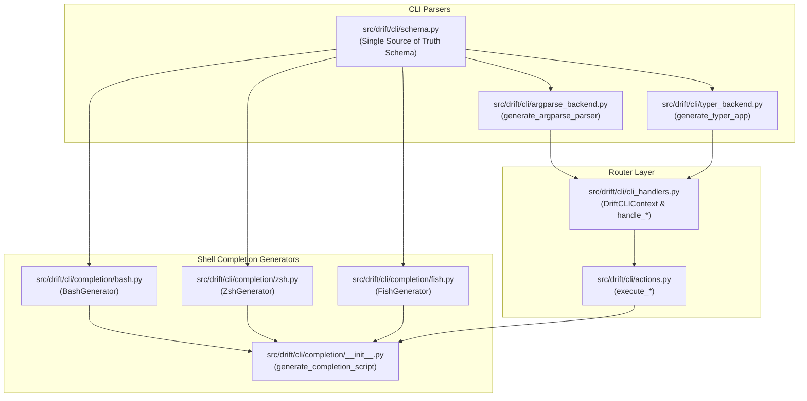

# 🐚 Interactive Shell Tab-Completion Architecture & Specification

## 1. Overview & Objectives

This document specifies the technical design, command taxonomy, declarative schema model, and **compiler-based code generation architecture** for **Interactive Tab-Completions** in Drift across `bash`, `zsh`, and `fish`.

### Core Architectural Principles:
1. **Single Source of Truth (`src/drift/cli/schema.py`)**: All commands, flags, descriptions, positional patterns, and choice hints live in a declarative Python schema. Shell scripts and CLI parser backends are compiled programmatically from this data model.
2. **Rich Interactive Hints**: Shells with interactive menu support (Zsh and Fish) automatically display detailed documentation descriptions for subcommands, options, and fixed choices (e.g. lifecycle hooks, manual topics, install methods).
3. **Dynamic Discovery**: Package names are queried live on `<TAB>` by scanning `src/`, with automatic fallback searching parent directories for `drift.toml` and honoring `-C / --directory`.
4. **Dual-Mode `new` Command**: Seamlessly accepts free-text for brand-new packages or completes existing folders in `src/` to scaffold missing configuration files.
5. **Zero-Latency Execution**: Generated shell scripts execute entirely in native shell memory, eliminating Python interpreter startup overhead during `<TAB>`.
6. **Movable Global Flags**: Options designated in `MOVABLE_GLOBAL_FLAGS` (such as `--json` and `-v/--verbose`) are supported both before and after subcommands across all shell engines and CLI backends.

---

## 2. Command Syntax & Positional Argument Taxonomy

Drift commands are categorized into **8 distinct positional argument patterns**:

| Category | Positional Pattern | Drift Commands | Expected `<TAB>` Behavior |
| :--- | :--- | :--- | :--- |
| **A. None** | `None` | `init`, `gc`, `repair` | Complete command flags only; no positional completions. |
| **B. Zero or More Packages** | `[packages...]` | `deploy`, `status`, `diff`, `adopt`, `rollback`, `health`, `render`, `stage`, `apply`, `reverse-sync`, `render-commit`, `install-commit` | Complete package names from `src/`. Multiple package names allowed sequentially. |
| **C. One or More Packages** | `<packages...>` | `uninstall` | At least one package required; complete package names repeatedly. |
| **D. Package + Hook Name** | `<package> <hook>` | `hook` | **Arg 1**: Existing package name from `src/`.<br>**Arg 2**: Lifecycle hook name with full descriptions. |
| **E. Package + File Paths** | `<package> <paths...>` | `add` | **Arg 1**: Existing package name from `src/`.<br>**Arg 2+**: Host system file or directory paths. |
| **F. New or Existing Package** | `<package_name>` | `new` | **Arg 1**: Free-text string (brand-new package) **or** an existing folder name in `src/` (to scaffold missing configuration in an existing folder).<br>Flags: `-m/--method` (`stow` / `copy`), `-t/--target` (directories). |
| **G. Fixed Topic / Shell Choices** | `[topic]` / `[shell]` | `help`, `complete` | **`help`**: Complete built-in manual topics with descriptions.<br>**`complete`**: Complete supported shell targets (`bash`, `zsh`, `fish`). |
| **H. Git URL + Destination** | `<git_url> [destination]` | `clone` | **Arg 1**: URL/path (free-text).<br>**Arg 2**: Destination directory path. |

---

## 3. End-to-End System Architecture



---

## 4. The Declarative Schema Model (`src/drift/cli/schema.py`)

All completion metadata, hints, and structural relationships are encapsulated in clean Python dataclasses:

```python
from dataclasses import dataclass, field
from enum import Enum, auto
from typing import List, Optional, Dict, Any

class SourceType(Enum):
    NONE = auto()             # No completion / free text
    DYNAMIC_PACKAGES = auto() # Evaluates live package list (e.g. `ls src/`)
    FIXED_CHOICES = auto()    # Predefined static Choice items (e.g. hooks, topics, shells)
    FILES = auto()            # Filesystem files
    DIRECTORIES = auto()      # Filesystem directories

@dataclass(frozen=True)
class Choice:
    value: str
    description: str          # Interactive hint displayed in Zsh/Fish menus

@dataclass
class OptionSpec:
    flags: List[str]          # e.g. ["-m", "--method"]
    description: str          # Documentation hint
    takes_value: bool = False
    dest: Optional[str] = None
    default: Any = None
    type: Optional[Any] = None
    required: bool = False
    action: Optional[str] = None
    choices: Optional[List[Choice]] = None
    is_directory: bool = False
    is_file: bool = False
    mutex_group: Optional[str] = None

@dataclass
class PositionalSpec:
    name: str                 # e.g. "package", "hook_name", "paths"
    description: str          # Argument description hint
    source_type: SourceType = SourceType.NONE
    choices: Optional[List[Choice]] = None
    nargs: Optional[str] = None
    default: Any = None
    repeatable: bool = False  # True for `packages...` or `paths...`
    required: bool = True     # False if optional (e.g. `[packages...]`)
    allow_free_text: bool = False # True for 'new' command

@dataclass
class CommandSpec:
    name: str
    description: str
    positionals: List[PositionalSpec] = field(default_factory=list)
    options: List[OptionSpec] = field(default_factory=list)

@dataclass
class CompletionSchema:
    cli_name: str
    description: str
    global_options: List[OptionSpec]
    commands: Dict[str, CommandSpec]
```

### Choice Registries & Movable Global Flags

```python
LIFECYCLE_HOOKS: List[Choice] = [
    Choice("pre_source", "Run before reading source templates (CWD: src/<pkg>)"),
    Choice("post_render", "Run after sandbox compilation (CWD: render/<pkg>)"),
    Choice("pre_install", "Run before first-time installation (CWD: install/<pkg>)"),
    Choice("post_install", "Run after successful first-time installation (CWD: target_dir)"),
    Choice("pre_update", "Run before update deployment (CWD: install/<pkg>)"),
    Choice("post_update", "Run after successful update deployment (CWD: target_dir)"),
    Choice("pre_uninstall", "Run before uninstallation (CWD: install/<pkg>)"),
    Choice("post_uninstall", "Run after uninstallation (CWD: target_dir)"),
    Choice("health", "Run runtime health check probe (CWD: target_dir)"),
]

HELP_TOPICS: List[Choice] = [
    Choice("overall", "High-level architectural model and loop overview"),
    Choice("package", "Package structure, directory layouts, and configuration"),
    Choice("src", "Declarative source templates and dot-prefix rules"),
    Choice("render", "Sandbox rendering zone, compilers, and DAG pipelines"),
    Choice("install", "State database mechanics, delta staging, and collision guards"),
    Choice("fcd", "Fully-Controlled Directories, wild file tracking, and adoption"),
    Choice("ignore", "PCRE ignore pattern rules and .drift_ignore mechanics"),
    Choice("drift_package.toml", "Package-level configuration reference"),
    Choice("drift.toml", "Workspace-level configuration reference"),
    Choice("workspace", "Multi-machine workflows, host profiling, and local overrides"),
    Choice("health", "Package runtime health check probes and hooks"),
    Choice("clone", "Workspace cloning, bootstrap self-healing, and legacy migration"),
    Choice("faq", "Frequently asked questions and troubleshooting guides"),
]

INSTALL_METHODS: List[Choice] = [
    Choice("stow", "Symlink-based deployment (ideal for user dotfiles)"),
    Choice("copy", "Direct physical copy deployment (ideal for system configs)"),
]

SHELLS: List[Choice] = [
    Choice("bash", "GNU Bourne-Again Shell completion script"),
    Choice("zsh", "Z Shell completion script with rich descriptions"),
    Choice("fish", "Fish Shell declarative completion script"),
]

GLOBAL_OPTIONS: List[OptionSpec] = [
    OptionSpec(["-C", "--directory"], "Run in <directory> instead of current working directory", takes_value=True, is_directory=True),
    OptionSpec(["--no-git-root"], "Stop resolving git root of cwd or -C directory, using the literal path instead"),
    OptionSpec(["-v", "--verbose"], "Enable verbose (DEBUG) logging output"),
    OptionSpec(["--json"], "Output results in structured machine-readable JSON format"),
]

MOVABLE_GLOBAL_FLAGS: List[str] = [
    "--json",
    "-v",
    "--verbose",
]
```

---

## 5. Shell Code Generators (`src/drift/cli/completion/`)

The generator suite translates `CompletionSchema` into native shell completion scripts:

### 1. Bash Generator (`src/drift/cli/completion/bash.py`)
- Employs standard `_init_completion` and `compgen` builtins.
- Implements `_drift_packages()` helper scanning `src/` dynamically with `-C / --directory` and upward workspace root detection.
- Generates command parsing loops and positional argument tracking based on `pos_count`.

### 2. Zsh Generator (`src/drift/cli/completion/zsh.py`)
- Uses native Zsh `compsys` with `#compdef drift`, `_arguments -C -s`, and state transitions (`1: :->command`, `*:: :->args`).
- Emits dedicated choice functions (e.g. `_drift_hook_name_choices()`, `_drift_topic_choices()`) rendering multi-column interactive selection menus with colon-separated documentation (`value:Description`).

### 3. Fish Generator (`src/drift/cli/completion/fish.py`)
- Emits declarative `complete -c drift` rules with condition predicates (`__fish_use_subcommand` and `__fish_seen_subcommand_from`).
- Defines `__drift_packages` helper and registers positional completions via token counting tests (`test (count (commandline -poc)) -eq N`).

---

## 6. User Integration & Execution (`drift complete`)

The `drift complete` command prints the compiled shell completion script:

```bash
# Bash setup:
eval "$(drift complete bash)"            # Add to ~/.bashrc

# Zsh setup:
eval "$(drift complete zsh)"             # Add to ~/.zshrc

# Fish setup:
drift complete fish | source             # Add to ~/.config/fish/config.fish

# Auto-detect from $SHELL:
drift complete

# Machine-readable JSON output:
drift complete zsh --json
```
